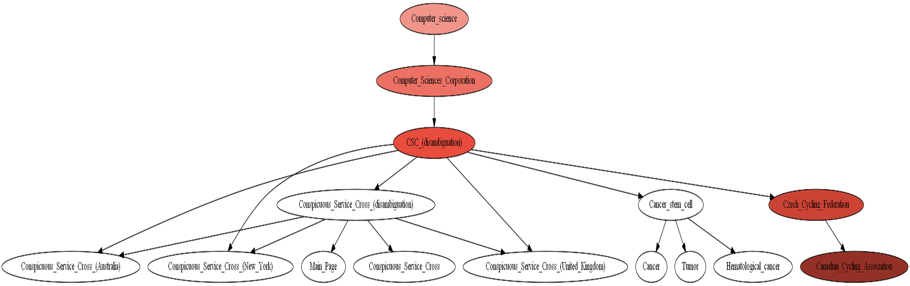

# 10-Degrees-Of-Wikipedia

The infamous 6-Degrees-Of-Wikipedia problem is stated as follows:

Given a source and target webpage on wikipedia, does there exist a 6-edge graph from the source webpage to the target webpage using only the URL's from wikipedia articles starting at the source webpage.

**Example:** 6 degrees of wikipedia -> Jesus -> Christianity is a 3-link with inputs (Source = "6 degrees of wikipedia", target = "christianity"). In other words, starting from the webpage article on wikipedia titled *6 Degrees of Wikipedia* I can find a link to the article *Jesus* and then from there, I can find an article to *Christianity* completing the 3-link.

# Visualization

Here is a visual example of a 5-link from *Computer Science* to *Canadian Cycling Association*
